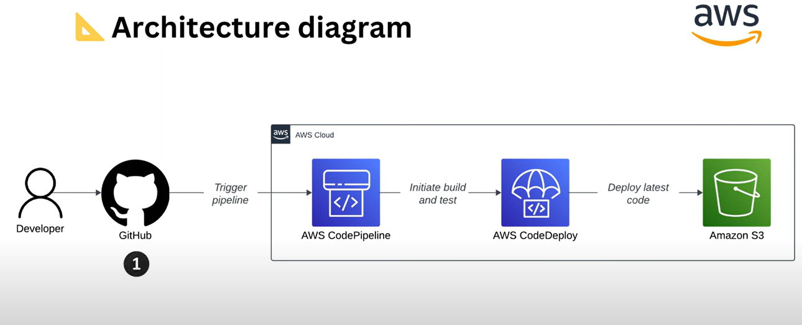
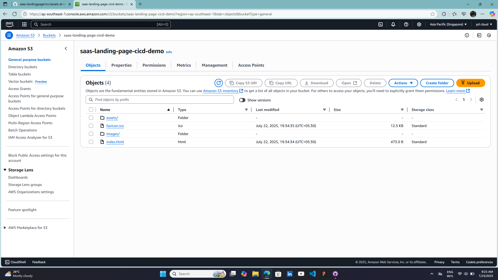
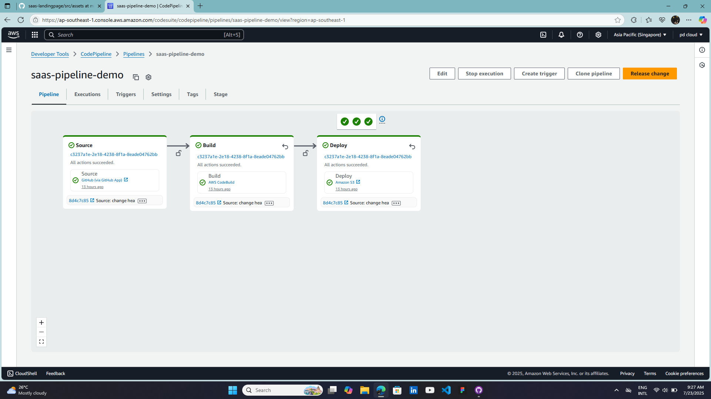
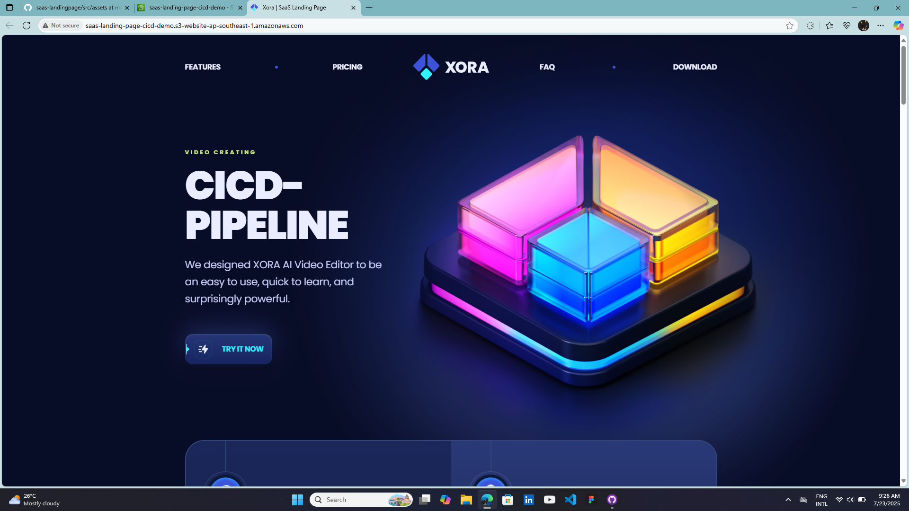

# AWS CI/CD Pipeline Architecture

This repository contains an architecture diagram that illustrates a basic Continuous Integration and Continuous Deployment (CI/CD) pipeline using AWS services and GitHub.

## 🔧 Pipeline Overview

1. **Developer** pushes code to a GitHub repository.
2. **GitHub** triggers the CI/CD pipeline via a webhook.
3. **AWS CodePipeline** orchestrates the flow:
   - Fetches the latest code from GitHub.
   - Triggers the build and testing process.
4. **AWS CodeDeploy** handles deployment:
   - Deploys the tested code to the destination.
5. **Amazon S3** stores and serves the deployed code (typically static websites or frontend assets).

## 🧰 Technologies Used

- GitHub
- AWS CodePipeline
- AWS CodeDeploy
- Amazon S3

## 📁 Project

AWS S3 Bucket : 

AWS CodePipeline :

Webpage Hosting :

